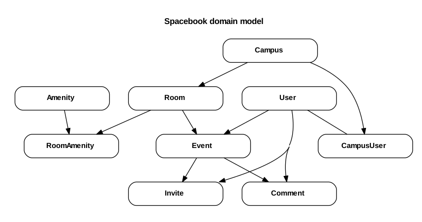

# Spacebook Project  

A conference room scheduler and management application for enterprise.

Heroku link: [http://tiy-spacebook.herokuapp.com/](http://tiy-spacebook.herokuapp.com/)

All wireframes are in `./app/doc`
